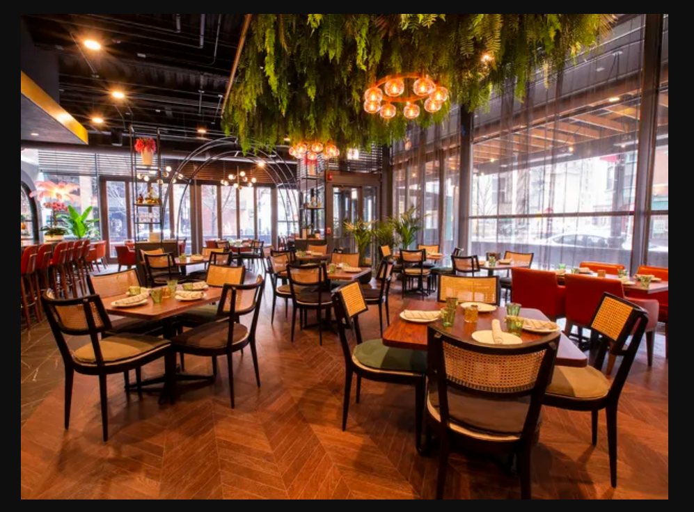
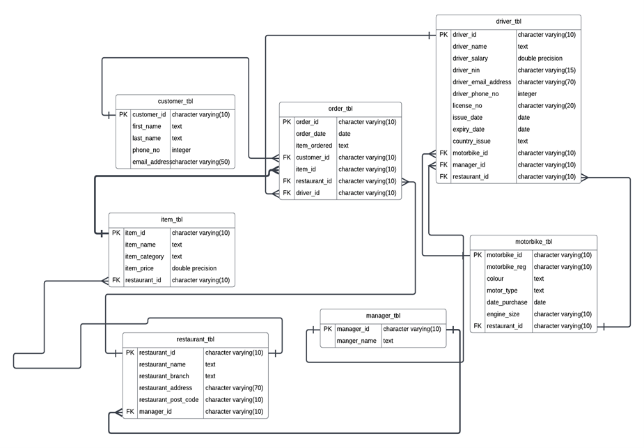

# Database-Creation-for-Kangaroo-RDBMS-

## Introduction

## Scenario 

Kangaroo is an online delivery company, which is looking for the development of an effective Relational Database Management System (RDBMS) and data warehouse to satisfy the needs of the growing business. As a data analyst, I have been asked to develop a required system for Kangaroo. 

## Problem Statement 

#### Develop the system that satisfies the following business information requirements:

•	The database should contain information about Customers, Items, Restaurants, Orders, Drivers and their Vehicle. For payroll, the National Insurance (NI) number of the drivers is recorded.

•	For each customer, the database should store the Customer ID, Last Name, First
Name, Email, and the Phone Number.

•	For each driver, their name, salary, email address and their manager are recorded
as well as details of their Driving License such as Driving License Number, Issue
Date, country of issue and Expiry Date.

•	Each driver is assigned a motorbike when they start with the company and they
normally keep it during the duration of their contract. Details of the motorbike are
registered such as Registration Number, colour, date of purchase, engine size etc.

•	Each Manager manages at least one driver, and each driver is associated with one
restaurant only, but one restaurant employs many drivers.

•	For each of the Restaurant, the Restaurant ID, Restaurant Name and Address are
recorded.

## Task one 

Design a relational database using either Chen’s notation or Crow Foot notation, capable of supporting the given business scenario. Your design should include Relationships and any participation constraints

Solution 

I created a **_table with the following entities and attributes_**

**_Entity: customer_tbl_**

**_Attributes_**:

- customer_id (character varying(10))
- first_name (text)
- last_name (text)
- phone_no (integer)
- email_address (character varying(50))

**_Entity: driver_tbl_**

**_Attributes_**:

- driver_id (character varying(10))
- driver_name (text)
- driver_salary (double precision)
- driver_nin (character varying(15))
- driver_email_address (character varying(70))
- driver_phone_no (integer)
- license_no (character varying(20))
- issue_date (date)
- expiry_date (date)
- country_issue (text)
- motorbike_id (character varying(10))
- manager_id (character varying(10))
- restaurant_id (character varying(10))

**_Entity: item_tbl_**

**_Attributes_**:

- item_id (character varying(10))
- item_name (text)
- item_category (text)
- item_price (double precision)
- restaurant_id (character varying(10))

**_Entity: manager_tbl_**

**_Attributes_**:

- manager_id (character varying(10))
- manager_name (text)

**_Entity: motorbike_tbl_**

**_Attributes_**:

- motorbike_id (character varying(10))
- motorbike_reg (character varying(10))
- colour (text)
- motor_type (text)
- date_purchase (date)
- engine_size (character varying(10))
- restaurant_id (character varying(10))

**_Entity: order_tbl_**

**_Attributes_**:

- order_id (character varying(10))
- order_date (date)
- item_ordered (text)
- customer_id (character varying(10))
- item_id (character varying(10))
- restaurant_id (character varying(10))
- driver_id (character varying(10))

**_Entity: restaurant_tbl_**

**_Attributes_**: 

- restaurant_id (character varying(10))
- restaurant_name (text)
- restaurant_branch (text)
- restaurant_address (character varying(70))
- restaurant_post_code (character varying(10))
- manager_id (character varying(10))

## Entity Relation Diagram for Kangaroo Database

The ERD was designed using **-CROW'S FOOT NOTATION-**

**This design includes the following relationship and participation constraints.**

- A customer can place many orders, and an order can be placed by one customer. This is a one-to-many relationship between the customer_table and order_table.

- A driver can deliver many orders, and an order can be delivered by one driver. This is a one-to-many relationship between the driver_table and order_table.

- An item can be part of many orders, and an order can have many items. This is a many-to-many relationship between the item_table and order_table, which is resolved using a foreign key relationship between the item_id in the item_table and the item_id in the order_table.

- A manager can manage many restaurants, and a restaurant can have one manager. This is a one-to-many relationship between the manager_table and restaurant_table.

- A motorbike can be used by many drivers, and a driver can use one motorbike. This is a one-to-many relationship between the motorbike_table and driver_table.

- A restaurant can have many motorbikes, and a motorbike can belong to one restaurant. This is a one-to-many relationship between the restaurant_table and motorbike_table.

- An order can be associated with one restaurant, and a restaurant can have many orders. This is a one-to-many relationship between the restaurant_table and order_table.

- An order can be associated with one item, and an item can be part of many orders. This is a one-to-many relationship between the item_table and order_table.

- An order can be delivered by one driver, and a driver can deliver many orders. This is a one-to-many relationship between the driver_table and order_table.

